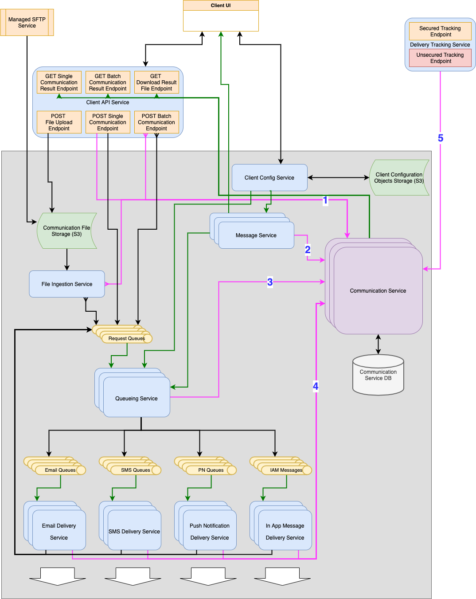
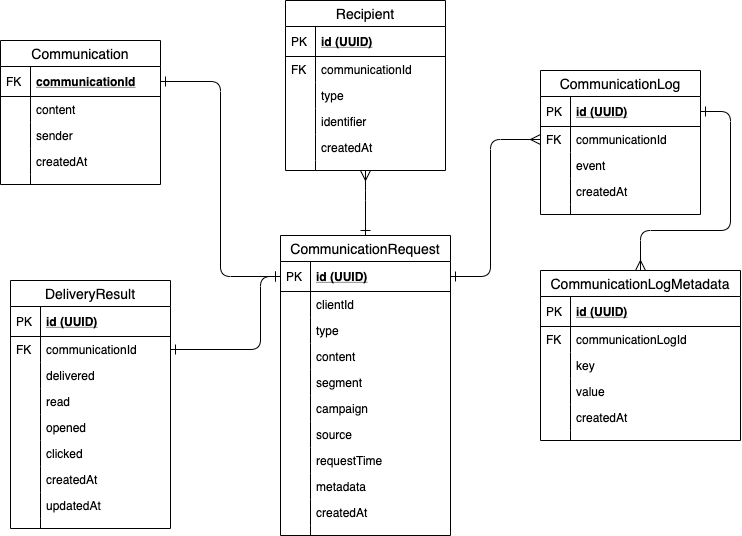

# Proposed Design for the Communication Delivery Platform

  * [Overview](#overview)
  * [Assumptions and Other Considerations](#assumptions-and-other-considerations)
  * [Design](#design)
    + [Diagram](#diagram)
    + [Diagram Key](#diagram-key)
    + [Logic Flow](#logic-flow)
    + [Models](#models)
      - [CommunicationRequest](#communicationrequest)
      - [Communication](#communication)
      - [Template](#template)
      - [Segment](#segment)
      - [Campaign](#campaign)
    + [Components](#components)
      - [Client UI](#client-ui)
      - [Client Config Service](#client-config-service)
      - [Communciation Service](#communciation-service)
        * [CommunicationLog Events](#communicationlog-events)
      - [Message Service](#message-service)
      - [Queueing Service](#queueing-service)
      - [Delivery Services](#delivery-services)
    + [Additional Notes](#additional-notes)
  * [Monitoring](#monitoring)

## Overview

This document details a proposed design for a Communication Delivery Platform. The system allows for requesting communication deliveries via various means, detailed reporting on individual communications and aggregate statistics, scaling based on volume and much more.

## Assumptions and Other Considerations
- It's desirable for the system to be an orchestration of various highly specialized microservices. There are no strict limitations of resources to be used for the solution within reason.
- Not included in the diagram and this document is an authentication/authorization component. Although not included in the diagram for simplicity, such a component is integral for the design. All externally exposed secure endpoints and gateways need to integrate with the authentication/authorization component in order to correctly allow or block access. In addition to externally facing endpoints, requests between internal components need to be authenticated as well for added security. A managed service such as AWS Cognito can be used for this component.
- Clients segment their users outside of the system. Clients are more likely to have data in their own databases that are more suitable for segmentation. So, when they send us a Communication Request, it can contain a segmentId that we can use to look up templates, configs ... etc.

## Design

### Diagram

### Diagram Key

- **Blue Round Rectangle:** Service that can be implemented in a 'serverless' fashion.
- **Purple Round Rectangle:** Service with a dedicated DB.
- **Orange Rectangle:** Secured Resource accessible by clients.
- **Red Rectangle:** Unsecured Resource potentially accessible by anybody. 
- **Green Arrow:** Read Operation. 
- **Black Arrow:** Write Operation.
- **Black Double Pointed Arrow:** Read and Write Operation.
- **Gray Rectangle:** Private Subnet.

### Logic Flow

Here's a brief enumeration of the various steps in the delivery pipeline a typical communication delivery request goes through.
1. A client requests for a single communication or a batch of communications to be delivered using one of the following:
	- The single/batch POST endpoints.
	- The file upload endpoint.
	- By dropping a file via SFTP to the managed SFTP server.
2. The request is processed as follows:
	- For requests posted via the POST endpoints, the Client API Service initiates each communication request via the Communication Service and sends it to the Request Queues.
	- For file-based requests:
		- The file is moved into object storage such as AWS S3.
		- A File Ingestion Service listening to the object storage picks up the file, validates it and extracts communication requests.
		- The File Ingestion Service initiates each valid communication request via the Communication Service and sends it to the Request Queues.
3. An instance of the Queuing Services reads the request from a queue and decides what to do with it based on multiple criteria, such as the clientId, the priority level of the queue from which the message was read, the status of the request i.e. was this request attempted before (retry) or is it brand new? ... etc. Based on the criteria,
	- If it's a new request,
		- The Queueing Service calls the Message Service to retrieve the fully rendered message content to be delivered.
		- The Message Service marks the communication as rendered.
	- If it's a previously failed request,
		- The Service determines if a retry is warranted and if not, marks the communication as undeliverable.
	- For both new and old requests, the Queueing Service either:
		- sends the request to the appropriate queue immediately and marks it as queued, or
		- schedules the request to be sent to a queue at a later time and marks it as scheduled via the Communication Service.
4. An instance of the appropriate Delivery Service picks up the message and does the following:
	- Validate the communication for the channel.
	- Attempt to deliver the message and record the delivery attempt via the Communication Service.
	- Record the result of the delivery attempt via the Communication Service if the delivery mechanism for the channel allows.
	- Send the request back to the request queue if the delivery status was Failure.
5. For successfully delivered communications, certain actions (like opening an email, clicking a link ...) are routed through the Delivery Tracking Service via links created during Message rendering.
	- The Delivery Tracking System records the user action via the Communication Service.

### Models

The following are key concepts represented by model objects in the platform.

#### CommunicationRequest

An object representing a single request to send a communication to one or more recipients. A CommunicationRequest may or may not have a fully formed content. But, it either has content or metadata that can be used to produce the content. It also contains metadata that can later be used to report on the effectiveness of segments and campaigns.

#### Communication

An object containing all the data required to send a communication to one or more recipients. A communication includes a fully formed content, sender, type and a list of recipients. This is the core object driving communication history and reporting.

#### Template

A Template represents content with place holders in it that can be later rendered into a complete personalized message for an end-user using metadata provided by the client at delivery request time.

#### Segment

A Segment represents a group of end-users that a client would like to target for a specific variation of a message. How an end-user is assigned to a segment is handled by the client. A Segment has the following properties.
	- It is uniquely identified by its name for each client (Two segments for two different clients can have the same name).
	- A segment can be assigned to one template per client, per channel, per campaign.

#### Campaign

A Campaign for a client can be viewed as a specific collection of permutations of the segment, channel and template tuple to be used for a coordinated set of communications to be sent out for a specific purpose.

### Components

Some of the components in the diagram are self-explanatory. Below are some more details on some of the components that may not be obvious from the diagram.

#### Client UI

This is the main hub for clients to interact with the Delivery Platform. It is backed by the Client Config Service for configuration management including templates and it uses the Message Service to test rendering of templates. Users of the platform can do the following using the Client UI.
- Create/view/update/delete templates.
- Create/view/update/delete segments and assign templates to them.
- Create/view/update/delete campaigns.
- Create/view/update/delete delivery and retry configurations by segment, campaign, channel.
- Test templates by rendering them against custom metadata.
- View/Download reports on the efficacy of campaigns or a single batch of delivery requests.
- Upload a file of delivery requests.
- Attempt a single communication request.

#### Client Config Service

Stores and allows management of Client Configurations. Depending on the feature set needed by clients, this may have to be backed by a database.

#### Communciation Service

This, in many ways, is the central piece of the platform. This is the only Service backed by a dedicated database. It stores communications, along with their requests, every event they go through and their delivery statuses. It provides APIs to record CommunicationLog events and statistics that can be used to produce reports. The following diagram and the description of Events following it illustrate how the data models provided by this service fit together to allow granular reporting.

The data model lends itself very well to a NoSQL DB if that's desirable. This allows Communication Service to be horizontally scalable.

##### CommunicationLog Events

For each of the following events, a CommunicationLog with an event of the same name is persisted related to the Communication by ID.

- `CREATED`: CommunicationRequest is recorded for the first time in Communication Service by Client API Service or File Ingestion Service. At this stage, CommunicationRequest and Recipient entries are created using values obtained from user requests. 
- `CONTENT_RESOLVED`: The content and sender info for the communication is resolved by the Message Service and is saved in the Communication table.
- `QUEUED`: Communication is queued for a delivery attempt.
- `SCHEDULED`: Communication is scheduled to be attempted at a specific time.
- `DELIVERY_ATTEMPTED`: The Communication is attempted for delivery.
- `DELIVERY_SUCCEEDED`: The Communication is successfully delivered. And the DeliveryResult table is updated.
- `DELIVERY_FAILED`: The Communication failed to be delivered.
- `OPENED`: The Communication is opened. And the DeliveryResult table is updated.
- `READ`: The Communication is read. And the DeliveryResult table is updated.
- `CLICKED`: The Communication is clicked. And the DeliveryResult table is updated.

For each event, metadata can be included such as the name of the queue for `QUEUED` or the URL of the links for `CLICKED` ... etc.

As illustrated above, this kind of flow allows each table to be immutable except for the DeliveryResult table. And for each Communication, there can be many CommunicationLog events providing a rich view of the lifetime of the communication as it goes from a request to an end user's interaction. It also allows us to report on this data in a much more granular manner.

#### Message Service

This service is responsible for producing the final content to be sent to the recipient. It resolves the sender information based on the client and decorates the communication content with tracking URLs when applicable.

#### Queueing Service

This service doubles up as an orchestrator of communication requests and a scheduler. It reads requests from a queue and for each one, it resolves the final communication to be sent using the MessageService and queues or schedules it for delivery based on the various requirements. The fact that this is a separate service allows flexibility in implementing various strategies for prioritizing and scheduling communications. And it can serve as a key scaling point based on various parameters.

#### Delivery Services

These are highly specialized channel-specific services that can be scaled independently to deliver communications asynchronously.

### Additional Notes
- Queues and Services depicted as multiple stacks are potential scaling and optimization points. For example, More instances of the Communication Service can be spun up or ramped down depending on volume. Some queues along with dedicated Delivery Services can be dedicated to higher priority messages or higher profile clients, ... etc.

## Monitoring
